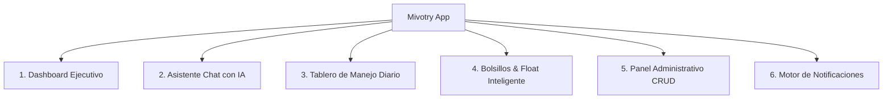

# Sistema de Diseño y Especificación: Mivotry App 🐾💰

**Mivotry** nace de la unión de los tres gatos del hogar y se consolida como una aplicación financiera personal de alta gama, conectada en tiempo real a Google Sheets mediante Google Apps Script.

---

## 1. Identidad Visual & Iconografía

* **Nombre de la App:** **Mivotry**
* **Mascota & Icono:** Silueta minimalista de un gatito guardián abrazando una moneda dorada, sobre fondo petróleo profundo.
* **Tono del producto:** Elegante, confiable, sereno, ágil y con un toque cálido/humano.

---

## 2. Paleta de Colores Calibrada (Dual Theme)

### Modo Oscuro (Predeterminado - Midnight Teal)
* **Primario de Marca:** `#0B2B33` (Petróleo Profundo / Deep Petrol Slate)
* **Fondo de Pantalla (Canvas):** `#06181D` (Dark Teal Caviar)
* **Superficies / Tarjetas Elevadas:** `#0F3741` (Deep Sea Surface)
* **Acento Principal (Éxito / Dinero):** `#10B981` (Mint Esmeralda) & `#F59E0B` (Oro Gatuno para ahorros)
* **Acento Alerta (Fondos bajos / Saldo crítico):** `#EF4444` (Coral Carmesí)
* **Texto Primario:** `#F1F5F9` (Blanco Hielo)
* **Texto Secundario / Labels:** `#94A3B8` (Gris Pizarra)
* **Bordes & Separadores sutiles:** `rgba(255, 255, 255, 0.08)`

### Modo Claro (Luz Ámbar / Editorial Paper)
* **Primario:** `#0B2B33` (conserva la identidad en botones y cabeceras)
* **Fondo de Pantalla:** `#F8FAFC`
* **Superficies:** `#FFFFFF` con sombras suaves entintadas en azul petróleo
* **Bordes:** `#E2E8F0`

---

## 3. Tipografía

Evitamos tipografías genéricas de sistema para darle identidad premium y alta legibilidad:
1. **Titulares y Display:** **Outfit** (Sans-serif geométrica con terminaciones suaves, moderna y con personalidad).
2. **Cuerpo de texto & Chat:** **Plus Jakarta Sans** (Excelente espaciado y legibilidad móvil a tamaños pequeños).
3. **Cifras Monetarias & Balances:** **JetBrains Mono** o **Geist Mono** con alineación tabular para que las cantidades no bailen al cambiar de valor.

---

## 4. Filosofía de Animación & Micro-interacciones (Motion Craft)

Siguiendo estándares modernos de ingeniería de diseño:
* **Física de Resortes (Springs):** Cero transiciones lineales mecánicas. Usaremos `react-native-reanimated` con resortes naturales (`damping: 18, stiffness: 120`).
* **Tactile Press Feedback:** Todos los botones, switches y tarjetas se comprimen un `3%` (`scale: 0.97`) al tacto antes de responder.
* **Waterfall Reveals:** Al abrir el Dashboard o cambiar de quincena, las tarjetas de gastos entran en cascada escalonada con retraso de 35ms entre sí.
* **Barra de Presupuesto Viva:** Barras de progreso de `Manejo` que cambian suavemente de color conforme se agota el disponible:
  * `> 40%`: Verde Esmeralda (`#10B981`)
  * `15% - 40%`: Amarillo Dorado (`#F59E0B`)
  * `< 15%`: Rojo Coral Pulsante (`#EF4444`)

---

## 5. Módulos & Pantallas de la App

### 1. 📊 Dashboard Ejecutivo (Visualización Rápida)
* **Hero Card:** Saldo total disponible en cuenta + total en Bolsillo de Rendimientos.
* **Selector Quincenal Activo:** Toggle interactivo `Quincena 15` | `Quincena 30`.
* **Gráficos Dinámicos:**
  * Dona / Anillo con el consumo de la quincena (Gastado vs. Restante).
  * Comparativa de gastos fijos vs. variables (Salidas, Gasolina, Bonos).
* **Acceso Rápido de Emergencia:** Botón flotante para registrar gasto en 2 clics.

### 2. 💬 Asistente Chat Inteligente (Entrada por Lenguaje Natural)
* Input con estilo moderno (burbujas con efecto glassmorphism).
* Entiende comandos en lenguaje cotidiano:
  * *"Anotar 45.000 de gasolina"*
  * *"Pagué 120k en PriceSmart con la de bonos"*
  * *"Mauro me pagó 50 mil"*
* Genera **tarjetas de confirmación interactivas** antes de tocar Google Sheets.

### 3. 💰 Tablero de Manejo (Nómina vs. Bonos)
* **Pestaña Nómina:** Tus filas de `A:1 a D:22` reflejadas en `F:1 a F:22`.
  * Botón **"Cargar Quincena"** (calcula rollover automático sumando remanentes).
  * Celda especial `F:20` visualizada como **"Fondo Ocasional / Vacaciones"**.
  * Modo manual: Tocar un rubro para ajustar el monto restante o marcarlo como "Pagado".
* **Pestaña Bonos:** Control independiente de $1.600.000 (PriceSmart, Verduras, Gatos, Salidas).

### 4. 📈 Bolsillo de Rendimientos & Primas
* **Float de Créditos:** Dinero retenido que genera intereses antes del día de corte (ej. los $1.530.000 de la quincena del 30 que esperan al 15 de Occidente).
* **Ahorro Inversiones:** Balance acumulado intocable.
* **Módulo de Primas (Semestral):** Simulador y distribuidor para inyectar a Pagos Anuales (SOAT, Predial, Impuestos, Tecno).

### 5. ⚙️ Panel Administrativo (Gestión Total sin tocar Sheets a mano)
* **Agregar / Editar Categorías:** Crear un nuevo rubro fijo o variable si tus gastos cambian.
* **Gestión de Streaming:** Agregar nueva plataforma, fijar monto y asignar tarjeta emisora.
* **Gestión de Créditos & Cuentas por Cobrar:** Crear nuevas deudas o registrar nuevos amigos/deudores.
* **Configuración de la conexión:** Test de conectividad en vivo con Google Apps Script.

### 6. 🔔 Sistema de Notificaciones & Alertas de Dinero
* **Alerta de Saldo Crítico ("Gatito Alerta"):** Notificación push local si una categoría de `Manejo` cae por debajo del 15% antes de la próxima quincena.
* **Recordatorio de Vencimientos:** Alertas 3 días antes de las cuotas de créditos o fechas de pago de streaming.
* **Notificación de Cierre de Quincena:** Recordatorio el día 14 y el día 29 con el balance que vas a trasladar a la siguiente quincena.
